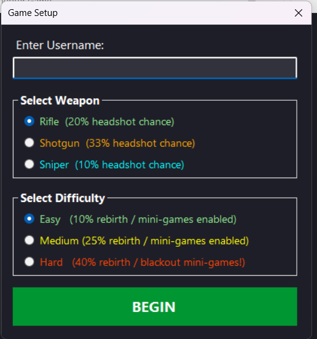
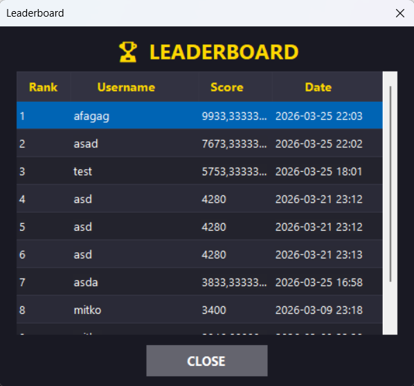

# Shooter Game


A **2D tactical grid shooter** built with Windows Forms, designed as a deep exploration of **Advanced OOP**, **Design Patterns**, and **LINQ** in C#. Every enemy type, weapon, and game mechanic is driven by polymorphism — not `if/else` chains.


---

## Table of Contents

- [Overview](#overview)
- [Core Features](#core-features)
- [The Mini-Games (Deep Dive)](#-the-mini-games-deep-dive)
- [Weapon Mechanics](#-weapon-mechanics)
- [Difficulty Breakdown](#difficulty-breakdown)
- [Architecture & Patterns](#architecture--patterns)
- [How to Play](#how-to-play)
- [Screenshots](#screenshots)

---

## Overview

You are dropped onto a randomized grid map populated with hostile enemies. Pick your weapon, choose your difficulty, and eliminate every target on the board. Each enemy type fights back with a **unique polymorphic mini-game** when hit — reflexes, memory, and sequencing skills are all put to the test.

Your score is tracked in real time via the **Observer pattern**, every shot is undoable via the **Command pattern**, and your final stats are persisted to a **JSON-serialized leaderboard**.

---

## Core Features

| Feature | Description |
|---|---|
| **4 Enemy Types** | Orc, Warrior, Wizard, Tank — each with unique health, regeneration, and mini-games |
| **3 Weapons** | Rifle, Shotgun, Sniper — each with a distinct special action that fires inside mini-games |
| **3 Difficulty Levels** | Easy, Medium, Hard — Hard enables enemy rebirth and visual impairments (blackouts) |
| **Polymorphic Mini-Games** | Hit an enemy and their `SpecialMove()` opens a type-specific challenge |
| **Undo System** | Full state snapshots via the Command pattern — press Ctrl+Z to reverse any shot |
| **Live Stats (Observer)** | Kills, damage, and points update the UI in real time through event subscription |
| **JSON Leaderboard** | Top 10 scores serialized to `leaderboard.json` — fully portable, no database |
| **Save / Load Game** | Full session state (map, enemies, combat log, move history) serialized to `savegame.json` |
| **Keyboard + Mouse** | WASD / Arrow movement, Space / Enter / Click to shoot, H for hint, Ctrl+Z to undo |

---

## The Mini-Games (Deep Dive)

When you land a hit on an enemy, there is a **30% chance** their `SpecialMove()` triggers — opening a mini-game determined entirely by the enemy's concrete type at runtime. This is polymorphism in action: the caller never knows which game will open. It simply calls `enemy.SpecialMove(difficulty, weaponType)` and gets back `true` (you win) or `false` (you lose and the enemy steals **150 points**).

Every mini-game also fires the equipped weapon's `SpecialAction()` the moment it opens — adding recoil, a jam clearance, or a breath-hold overlay on top of the challenge.

---

### Orc — Target Pursuit

A green target **teleports** to a random position every 500ms. Click it within **3 seconds** before it vanishes again.

- **Hard Mode**: Random 300ms blackout flashes every 1.2 seconds hide the entire arena.


---

### Warrior — Velocity Strike

A fast-moving red target **bounces** off the edges of the arena. Track it and click it within **3 seconds**.

- **Hard Mode**: Target velocity jumps from 7 to 9. Blackouts hit every 1 second.


---

### Wizard — Illusion Gambit

Three circles appear — one **real Wizard** (larger, purple, marked "W") and two **clones** (smaller, grey, marked "?"). You get **8 seconds** and a single click. Pick the real one or fail.

- **Hard Mode**: Blackouts every 1.2 seconds. One wrong click ends it immediately.


---

### Tank — Shield Sequence

Three shields spawn in randomized positions — **Small** (blue), **Medium** (orange), **Large** (red). Click them in the correct order (**Small -> Medium -> Large**) within **5 seconds**. Click the wrong shield and you fail instantly.

- **Hard Mode**: 300ms blackouts every 1.2 seconds obscure the field while you sequence.


---

## Weapon Mechanics

Every weapon has a `SpecialAction()` that fires **inside the mini-game forms**, layering an additional challenge on top of each enemy encounter.

| Weapon | Base Damage | Headshot Chance | Special Action |
|---|---|---|---|
| **Rifle** | 440 | ~5% | Recoil — cursor physically displaced + "RECOIL!" flash |
| **Shotgun** | 297 | ~10% | Jam — must press Space 5 times in 5 seconds to unjam or lose the turn |
| **Sniper** | 800 | ~10% | Hold Breath — "+50% accuracy" overlay for 2 seconds |

### Sniper — Hold Breath
When a mini-game opens, a cyan banner appears: **"HOLDING BREATH — AIM STEADY (+50% accuracy)"**. It lingers for 2 seconds, giving you a visual cue that your aim is enhanced. Highest single-shot damage in the game.

### Shotgun — Jam Clearance
Before the mini-game begins, a separate **Jam Clearance** form opens. Press **Space 5 times within 5 seconds** to clear the jam. Fail, and your entire turn is forfeit — the shot never fires.

### Rifle — Recoil Kick
The moment the mini-game opens, your cursor is physically displaced by a random offset and a **"RECOIL!"** flash appears for 600ms. Balanced damage with steady headshot odds.

---

## Difficulty Breakdown

| Aspect | Easy | Medium | Hard |
|---|---|---|---|
| Enemy Rebirth Chance | 10% | 25% | 40% |
| Warrior / Tank Rebirth | Never | Never | Active (40%) |
| Mini-Game Blackouts | Off | Off | On |
| Warrior Mini-Game Speed | Normal (7) | Normal (7) | Boosted (9) |
| Mini-Game Loss Penalty | -150 pts | -150 pts | -150 pts |

On **Hard**, when a Warrior or Tank is reduced to 0 HP, they have a **40% chance to be reborn** with 25% of their maximum health and repositioned on the map — forcing you to hunt them down again.

---

## Architecture & Patterns

```
Shooter_Game0.1/
  Core/
    Commands/         # ShootCommand, CommandManager (Command Pattern)
    Contracts/        # ICommand interface
    Controller.cs     # Central game orchestration
  Models/
    Enemies/          # Abstract Enemy -> Orc, Warrior, Wizard, Tank
    Weapons/          # Abstract Weapons -> Rifle, Shotgun, Sniper
    Users/            # User + IUser with StatsChanged event (Observer)
    SaveData/         # SessionState, EnemyState, MoveState (JSON DTOs)
  Repositories/       # Generic IRepository<T> -> UsersRepository (JSON persistence)
  Forms/
    MiniGames/        # OrcMiniGameForm, WarriorMiniGameForm, WizardMiniGameForm,
                      # TankMiniGameForm, ShotgunJamForm
  Utilities/          # Difficulty enum, Randomizer, GameSerializer
```

### Command Pattern — Undo System

Every shot creates a `ShootCommand` that **snapshots** the full enemy state (life, coordinates, kill status) and user stats (damage, kills, points) before execution. Pressing **Ctrl+Z** pops the command stack and restores the previous state — a true, lossless undo.

### Observer Pattern — Live Stats

The `User` class fires a `StatsChanged` event every time `EnemiesKilled`, `DamageDealt`, or `Points` is set. `GameForm` subscribes once at startup and the stats bar updates automatically with zero polling.

### Polymorphism Everywhere

- **Enemies**: `enemy.SpecialMove()` dispatches to the correct mini-game form at runtime.
- **Weapons**: `weapon.SpecialAction(form)` applies recoil, jam, or breath-hold depending on the concrete type.
- **Rebirth**: `enemy.TryRebirth(difficulty)` — Warrior and Tank override the base class to restrict rebirth to Hard difficulty only.

### Scoring Formula

```
Points = (EnemiesKilled x 300) + (TotalDamageDealt / 3)
```

---

## How to Play

### Option A — Download the Release (Recommended)

1. Go to the [**Releases**](../../releases) tab.
2. Download the latest `.zip` archive.
3. Extract and run **`Shooter_Game0.1.exe`**. No install required.

### Option B — Build from Source

```bash
git clone https://github.com/DimitarTashkov/Shooter-Game-Project.git
cd Shooter-Game-Project/Shooter_Game0.1
dotnet build
dotnet run --project Shooter_Game0.1
```

> Requires [.NET 9.0 SDK](https://dotnet.microsoft.com/download/dotnet/9.0) or later on Windows.

### Controls

| Input | Action |
|---|---|
| `W A S D` / Arrow Keys | Move crosshair |
| `Space` / `Enter` / Left Click | Shoot |
| `Ctrl + Z` | Undo last shot |
| `H` | Directional hint toward nearest enemy |
| `R` | Show current stats |

---

## Screenshots

| Main Menu | Setup Screen |
|---|---|
|  |  |

| Gameplay | Leaderboard |
|---|---|
|  |  |

---

## Enemies at a Glance

| Enemy | HP Pool | Regen (once) | Mini-Game | Color |
|---|---|---|---|---|
| **Orc** | 600 | 30% (180 HP) | Target Pursuit — click a teleporting target | Green |
| **Warrior** | 900 | 10% (90 HP) | Velocity Strike — click a bouncing target | Crimson |
| **Wizard** | 1,250 | 20% (250 HP) | Illusion Gambit — find the real wizard among clones | Purple |
| **Tank** | 4,000 | 40% (1,600 HP) | Shield Sequence — click shields in order | Grey |

---

<p align="center">
  <b>Dimitar Tashkov</b> — <a href="https://github.com/DimitarTashkov">GitHub</a>
</p>
